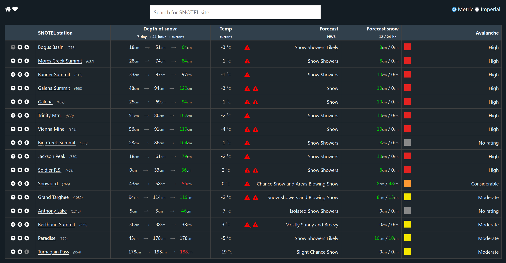

[](https://ci.rmilo.dev/robbymilo/backcountrydata.com)

A website for tracking your favorite SNOTEL stations, with additional forecast and avalanche data.

[Try it](https://backcountrydata.com/list/978,637,312,490,489,830,845,338,550,769,766,1082,1245,335,679,954)



## backcountrydata.com frontend app

Based off Vue.js CLI.

```
cd frontend
npm i
npm run serve
```

## backcountrydata.com API

Based off Express.

An API for accessing SNOTEL data in JSON format from the current water year. Data is cached and fetched every 15 minutes.

### Development

```
cd api
npm i
node app.js
```

### Endpoints

#### Hourly Data

Returns hourly data for a SNOTEL station. Points include air temp, snow depth, snow water equivalent, precipitation accumulation, wind direction, wind speed, and wind gust.

**URL** : `/api/hour/:id/?total=:hours`

**Parameters** :

`id=[integer]` where `id` is the SNOTEL station ID (required).

`hours=[integer]` where `hours` is the most recent hours to return (optional).

Example: /api/hour/978?total=2

#### Daily Data

Returns start of day (GMT-8) data for a SNOTEL station. Points include air temp, snow depth, snow water equivalent, precipitation accumulation, wind direction, wind speed, and wind gust.

**URL** : `/api/day/:id/?total=:days`

**Parameters** :

`id=[integer]` where `id` is the SNOTEL station ID (required).

`days=[integer]` where `days` is the most recent days to return (optional).

Example: /api/day/978?total=2

#### Station Meta

Returns meta data about a SNOTEL station.

**URL** : `/api/station/:id`

**Parameters** :

`id=[integer]` where `id` is the SNOTEL station ID (required).

Example: /api/station/978

#### Nearest from Station

Returns an array of the 10 closest stations to a SNOTEL station.

**URL** : `/api/nearest/:id`

**Parameters** :

`id=[integer]` where `id` is the SNOTEL station ID (required).

Example: /api/nearest/978

#### Nearest from Coordinates

Returns an array of the 10 closest stations to a lat/lon coordinates.

**URL** : `/api/nearest/?lat=latitude&lon=longitude`

**Parameters** :

`latitude=[integer]` (required).

`longitude=[integer]` (required).

Example: /api/nearest/?lat=43.7018976&lon=-116.3025711

#### Search

Returns an array of stations that are similar to query.

**URL** : `/api/nearest/?search=query`

**Parameters** :

`query=[string]` (required).

Example: /api/nearest/?search=boise

#### Forecast

Returns NWS forecast time series and scientific discussion for a SNOTEL station.

**URL** : `/api/station/:id`

**Parameters** :

`id=[integer]` where `id` is the SNOTEL station ID (required).

Example: /api/station/978

#### Avalanche

Returns the nearest 10 avalanche centers' report for a SNOTEL station.

**URL** : `/api/avy/:id`

Example: /api/avy/978

---

To fix the avalanche report at the beginning of winter, run `node geo.js`.
